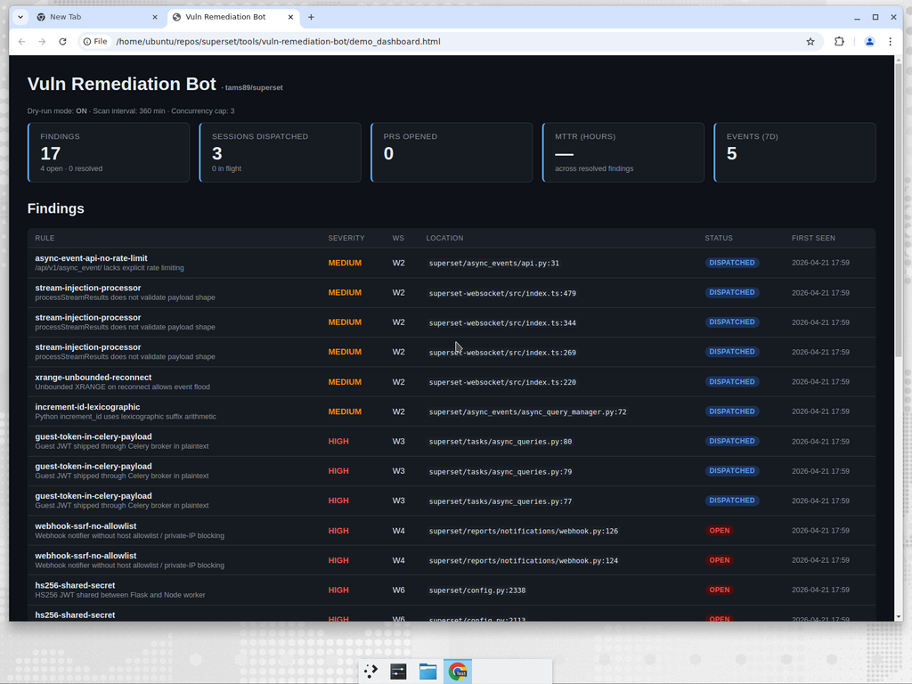
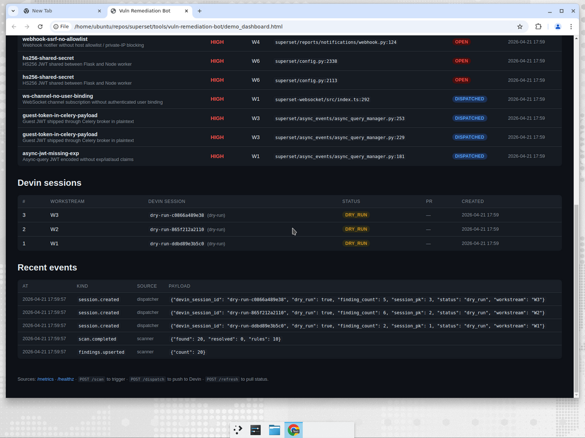

<!--
Licensed to the Apache Software Foundation (ASF) under one
or more contributor license agreements.  See the NOTICE file
distributed with this work for additional information
regarding copyright ownership.  The ASF licenses this file
to you under the Apache License, Version 2.0 (the
"License"); you may not use this file except in compliance
with the License.  You may obtain a copy of the License at

  http://www.apache.org/licenses/LICENSE-2.0
-->

# vuln-remediation-bot

An event-driven automation that closes the loop between a security audit and
real code: it scans the Superset repo for event-driven vulnerability patterns,
groups them into remediation workstreams, and **dispatches Devin sessions** via
the public Devin API to open PRs that fix them. A built-in dashboard and
`/metrics` endpoint make the whole thing observable.

This tool is self-contained under `tools/vuln-remediation-bot/` and ships with
its own Python package, tests, and dashboard. It does not change Superset
runtime behaviour.

## Why

The earlier security audit of the async-query / event pipeline surfaced 15
findings across 6 remediation workstreams (see `docs/`). Handing that list to a
human queue is slow and drops between releases; handing it to Devin sessions
one-by-one is manual. The bot turns both halves into an **event-driven loop**:

| Event                        | Bot reaction                                    |
|------------------------------|-------------------------------------------------|
| GitHub `push` to `master`    | Rescan, dispatch any new findings               |
| GitHub `pull_request.closed` | Record merge, correlate with session/finding    |
| Scheduled tick (every 6 h)   | Rescan + dispatch + poll Devin for status       |
| `POST /scan`, `/dispatch`    | Manual triggers for the same pipeline           |
| CLI `vuln-bot scan/dispatch` | Same pipeline, one-shot (good for demos)        |

## Architecture

```
 ┌─────────────┐   ┌───────────┐   ┌──────────────┐   ┌────────────┐   ┌─────────────┐
 │  Triggers   │──▶│  Scanner  │──▶│  Dispatcher  │──▶│ Devin API  │──▶│    GitHub   │
 │ GH webhook  │   │  regex +  │   │  dedupes &   │   │ v1/sessions│   │  PRs, CI    │
 │ cron        │   │  yaml rule│   │  rate-limits │   │            │   │             │
 │ /scan POST  │   │  pack     │   │  workstreams │   │            │   │             │
 └─────────────┘   └───────────┘   └──────────────┘   └────────────┘   └─────────────┘
         │              │                  │                  │                │
         └──────────────┴──────────────────┴──────────────────┴────────────────┘
                              state (SQLite)  +  NDJSON logs
                                          │
                                          ▼
                          /dashboard (HTML)  +  /metrics (JSON)
```

- **Scanner** — `rules/*.yaml` + `src/bot/scanner.py`. Each rule is
  `pattern` / `negate_pattern` / `globs`; the negate lets the rule suppress
  itself when the fix is already in place. Findings are keyed by a SHA-256 of
  `rule_id + file + line + snippet` so re-scans are idempotent.
- **Dispatcher** — `src/bot/dispatcher.py`. Groups open findings by the
  workstream the rule points at, skips workstreams that already have an
  in-flight session, caps concurrent sessions at
  `VULN_BOT_MAX_CONCURRENT_SESSIONS`, and builds a structured prompt from
  `src/bot/prompt_builder.py`.
- **Devin client** — `src/bot/devin_client.py`. Thin async wrapper around
  `POST /v1/sessions` and `GET /v1/session/{id}` with retry on 429/5xx.
- **State store** — `src/bot/models.py` + `src/bot/storage.py`. SQLite via
  SQLAlchemy; tables: `findings`, `devin_sessions`, `events` (append-only).
- **Observability** — `src/bot/metrics.py` + `src/bot/dashboard.py`. The same
  aggregate metrics power both the JSON `/metrics` endpoint and the HTML
  dashboard; `structlog` emits NDJSON to stdout for every state transition.

## Dashboard





## Install & run

### As a local CLI

```bash
cd tools/vuln-remediation-bot
python3 -m venv .venv
.venv/bin/pip install -e ".[dev]"

# Dry-run demo against the real Superset checkout
export VULN_BOT_REPO_PATH=/home/ubuntu/repos/superset
export VULN_BOT_REPO_SLUG=tams89/superset
export VULN_BOT_DATABASE_URL="sqlite+aiosqlite:///./demo.db"
export VULN_BOT_DRY_RUN=true

.venv/bin/vuln-bot scan       # → {"rules": 10, "found": 20, "resolved": 0}
.venv/bin/vuln-bot dispatch   # creates one Devin session per workstream
.venv/bin/vuln-bot metrics    # aggregates JSON
.venv/bin/vuln-bot serve      # http://localhost:8099
```

### As a long-running service

```bash
.venv/bin/vuln-bot serve --host 0.0.0.0 --port 8099
```

Then configure a GitHub webhook at
`https://<host>/webhook/github` (events: `push`, `pull_request`) with the
shared secret in `VULN_BOT_GITHUB_WEBHOOK_SECRET`.

### Flip from dry-run to live

```bash
export VULN_BOT_DRY_RUN=false
export VULN_BOT_DEVIN_API_KEY=cog_...
# optional:
export VULN_BOT_DEVIN_SESSION_PLAYBOOK=playbook-...
```

### Docker

```bash
docker build -t vuln-remediation-bot tools/vuln-remediation-bot
docker run -p 8099:8099 \
  -e VULN_BOT_REPO_PATH=/workspace \
  -e VULN_BOT_DEVIN_API_KEY=$DEVIN_API_KEY \
  -v $(pwd):/workspace:ro \
  vuln-remediation-bot
```

## Configuration

Every field in `src/bot/config.py` can be set via `VULN_BOT_<UPPER>`.
Highlights:

| Env var | Default | Purpose |
|---|---|---|
| `VULN_BOT_REPO_PATH` | `/home/ubuntu/repos/superset` | Filesystem path the scanner reads. |
| `VULN_BOT_REPO_SLUG` | `tams89/superset` | `owner/name` used in Devin prompts. |
| `VULN_BOT_DATABASE_URL` | `sqlite+aiosqlite:///./vuln_bot.db` | Async SQLAlchemy URL. |
| `VULN_BOT_DEVIN_API_KEY` | _(unset)_ | Service user token (`cog_...`). |
| `VULN_BOT_DEVIN_API_BASE` | `https://api.devin.ai/v1` | Override for staging. |
| `VULN_BOT_DEVIN_SESSION_PLAYBOOK` | _(unset)_ | Attach a playbook to each session. |
| `VULN_BOT_DRY_RUN` | `true` | Skip outbound API calls. |
| `VULN_BOT_MAX_CONCURRENT_SESSIONS` | `3` | Upper bound on in-flight Devin sessions. |
| `VULN_BOT_SCAN_INTERVAL_SECONDS` | `21600` (6 h) | Scheduler interval. |
| `VULN_BOT_GITHUB_WEBHOOK_SECRET` | _(unset)_ | HMAC secret for `X-Hub-Signature-256`. |
| `VULN_BOT_RULES_PATH` | `tools/vuln-remediation-bot/rules` | YAML rule directory. |

## Rule pack

`rules/event_driven.yaml` maps every finding from the original audit to a
workstream. Adding a new rule:

```yaml
- id: my-new-rule
  title: "..."
  workstream: W2
  severity: high
  globs: ["superset/some_module.py"]
  pattern: "dangerous_call\\("
  negate_pattern: "guarded_dangerous_call"   # optional
  remediation: |
    Plain-English instruction the Devin session should follow.
```

## API

| Method | Path | Purpose |
|---|---|---|
| GET | `/healthz` | Liveness check. |
| GET | `/` (alias `/dashboard`) | HTML dashboard. |
| GET | `/metrics` | Aggregate metrics JSON. |
| POST | `/scan` | Run the scanner now. |
| POST | `/dispatch` | Push pending findings to Devin (respects concurrency cap). |
| POST | `/refresh` | Poll Devin for status updates on in-flight sessions. |
| POST | `/webhook/github` | GitHub webhook endpoint (HMAC verified). |

## Observability

- **NDJSON logs** on stdout for every `dispatch.session.created`,
  `scan.completed`, `pr.merged`, and `scheduled_scan.failed`.
- **`/metrics`** returns counts grouped by status / severity / workstream
  plus mean time to resolve.
- **`events` table** is an append-only audit log queryable via SQL.

### "How would I know this is working?"

- **Engineering leader** → look at the dashboard: open findings going down,
  PRs opened going up, MTTR < target.
- **On-call engineer** → `tail` the NDJSON; every session dispatch has a
  `session_pk` and `devin_session_id`. Click through to the Devin UI.
- **Security team** → the `findings` table is the source of truth for what is
  open/resolved and when, with every resolution linked to a session + PR.

## Testing

```bash
cd tools/vuln-remediation-bot
.venv/bin/pytest -q      # 21 tests: scanner, dispatcher, Devin client, webhook, HTTP.
```

## Layout

```
tools/vuln-remediation-bot/
├── pyproject.toml
├── Dockerfile
├── README.md
├── docs/
│   ├── dashboard.png
│   └── dashboard_sessions.png
├── rules/
│   └── event_driven.yaml
├── src/bot/
│   ├── cli.py              # `vuln-bot …`
│   ├── config.py           # Pydantic settings
│   ├── dashboard.py        # Renders /dashboard
│   ├── devin_client.py     # Devin v1 API client
│   ├── dispatcher.py       # Dedupe + dispatch loop
│   ├── github_webhook.py   # HMAC verification + PR-merge parser
│   ├── logging_setup.py    # structlog → NDJSON
│   ├── main.py             # FastAPI app
│   ├── metrics.py          # Aggregate metrics
│   ├── models.py           # SQLAlchemy ORM
│   ├── prompt_builder.py   # Session prompt template
│   ├── scanner.py          # Rule loader + regex walker
│   ├── storage.py          # Async engine + session factory
│   └── templates/dashboard.html
└── tests/                  # pytest suite
```

## Licence

Apache 2.0.
